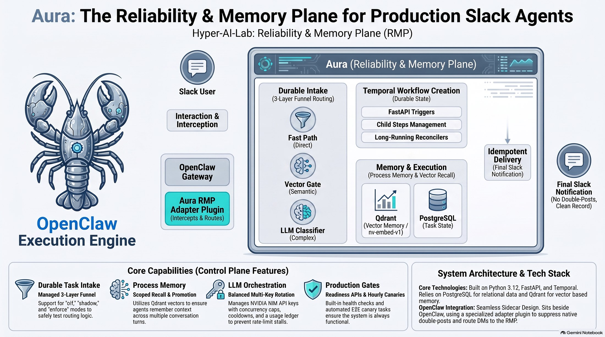
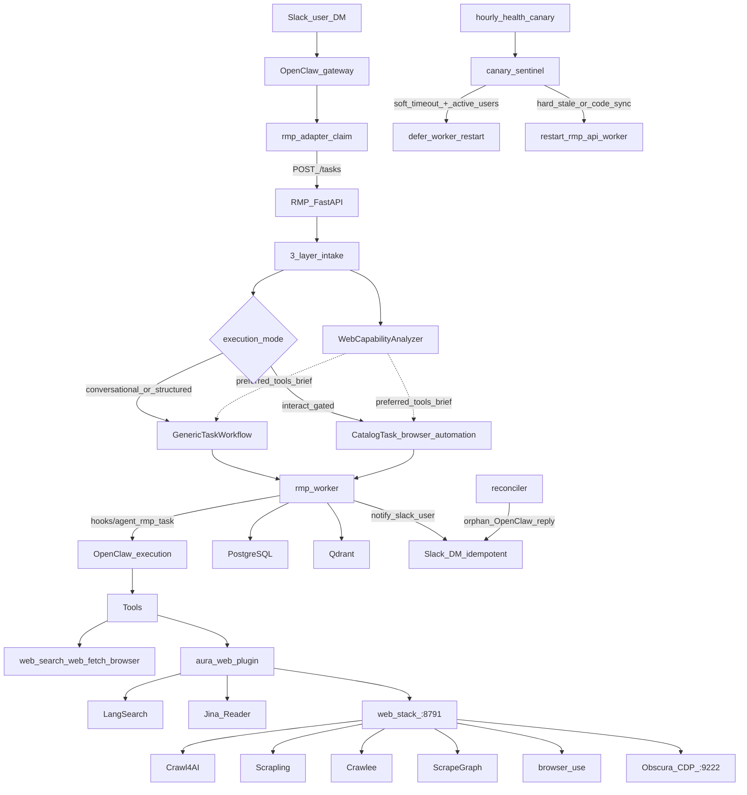

# Aura



[](LICENSE)
[](requirements.txt)
[](https://github.com/openclaw/openclaw)
[](https://github.com/Hyper-AI-Lab)

**Aura is a reliability & memory control plane for a production Slack agent.**  
It sits beside [OpenClaw](https://github.com/openclaw/openclaw) and turns every user turn into a durable Temporal workflow: intake routing, process memory, evidence gates, idempotent Slack delivery, multi-key LLM orchestration, and a routed galaxy web-research stack.

Built by [Hyper-AI-Lab](https://github.com/Hyper-AI-Lab) · Homepage: [hyperailab.com](https://hyperailab.com/)

---

## Why Aura exists

Chat-agent stacks are great at tools and models — and terrible at **ops truth**:

- Slack replies race with native gateway delivery  
- Sessions forget process context across turns  
- Rate limits stall the whole agent with no fair key rotation  
- “Done” is whatever the model claimed, not what evidence allows  
- Canary restarts can kill mid-flight user work if remediation is too aggressive  

Aura (the **Reliability & Memory Plane**, RMP) is the sidecar that owns those guarantees while OpenClaw stays the execution engine.

## What you get

| Capability | What Aura provides |
| --- | --- |
| Durable task intake | 3-layer funnel (fast path → vector gate → LLM classify) with `off` / `shadow` / `enforce` modes |
| Workflow control plane | Temporal `GenericTask` / `CatalogTask` workflows, child steps, reconciler + janitor |
| Process memory | Process-scoped recall + promotion; Qdrant vectors (`nv-embed-v1`) |
| Slack ownership | OpenClaw plugin routes DMs to RMP; RMP posts the final reply (no double-send / no native fallback) |
| LLM orchestration | Balanced NVIDIA key rotation, concurrency caps, fast idle rotate (~5s), usage ledger |
| Galaxy web stack | Brave + LangSearch search; Jina Reader; Crawl4AI / Scrapling / Crawlee / ScrapeGraphAI; OpenClaw `browser` + browser-use + Obscura CDP |
| Web capability routing | Intake analyzer picks `search` / `fetch` / `crawl` / `extract` / `interact` and injects a tool brief |
| Production gates | Readiness API, hourly canaries with **soft-fail deferral** (no worker restart while user tasks run), orphan-reply Slack recovery |

## Architecture

### Control-plane flow (current)



| Layer | Role |
| --- | --- |
| **OpenClaw** | Slack socket, LLM/tools, isolated `rmp_task_*` sessions (execution only — not Slack delivery owner) |
| **RMP (`app/`)** | API, workflows, intake, memory, quota broker, evidence, canary sentinel, reconciler |
| **Plugin (`plugins/rmp_adapter`)** | Intercepts Slack → creates RMP tasks; suppresses native double-posts (fail closed) |
| **Web (`plugins/aura_web`, `plugins/langsearch`, `web-stack/`)** | Multi-backend search/fetch/crawl/extract/browser tools + localhost FastAPI backends |

**Binding rules:** every Slack DM goes through RMP; MiniMax M3 is the primary chat model; LLM idle silence fails fast (~5s) and rotates NVIDIA keys.

Deep dive: [`ARCHITECTURE.md`](ARCHITECTURE.md) · Runbooks: [`docs/runbooks/`](docs/runbooks/)

## Repository layout

```text
aura/
├── app/                     # FastAPI + Temporal + memory + intake + web routing
├── plugins/
│   ├── rmp_adapter/         # Slack claim → RMP tasks
│   ├── aura_web/            # Galaxy web tools (Jina, Crawl4AI, …)
│   └── langsearch/          # LangSearch web_search provider + API key holder
├── web-stack/               # Local FastAPI backends + Obscura compose/systemd
├── ops/                     # Canaries, backup, janitor, patch verify
├── tests/                   # Pytest suite
├── docs/                    # Runbooks, history, architecture assets
├── patch_openclaw.sh        # Re-apply dist patches after OpenClaw upgrades
├── settings.example.json    # Config template (no secrets)
├── worker.py                # Temporal worker entrypoint
└── ARCHITECTURE.md          # Full system design
```

## Quick start

### Prerequisites

- Linux host (or VM) with Docker optional for Qdrant / Obscura / observability  
- Python 3.12+, Node.js ≥ 22.23 (OpenClaw engines)  
- PostgreSQL, Temporal, [OpenClaw](https://github.com/openclaw/openclaw) gateway  
- NVIDIA NIM (or compatible) API keys for chat + embeddings  
- Optional: Brave + [LangSearch](https://langsearch.com/) API keys; Obscura image `h4ckf0r0day/obscura`

### Setup

```bash
git clone https://github.com/Hyper-AI-Lab/aura.git
cd aura
python3 -m venv venv && source venv/bin/activate
pip install -r requirements.txt

cp settings.example.json settings.json
# set api_key, production.slack_owner_user_id, vector/qdrant, task_registry.intake_mode

# Link plugins into your OpenClaw plugins dir (rmp_adapter, aura_web, langsearch), then:
bash patch_openclaw.sh
bash ops/verify_openclaw_patch.sh

# Optional galaxy web backends + Obscura CDP
# systemctl enable --now aura-web-backends aura-obscura

# Start API + worker (systemd units or process manager of your choice)
# then:
make production-check
```

### Useful commands

```bash
make production-check   # health + OpenClaw patch verify + intake canaries
make canary             # manual E2E canary task
pytest -q               # unit/integration tests
curl -s http://127.0.0.1:8791/health   # web-stack backends (if enabled)
```

## Configuration notes

- **Never commit** `settings.json`, `.env`, auth profiles, or `data/`.  
- Example config: [`settings.example.json`](settings.example.json).  
- LangSearch / Jina keys live in OpenClaw `plugins.entries.*` (not this repo).  
- Obscura remote mode: `OBSCURA_CDP_URL=http://127.0.0.1:9222` (Hermes-compatible).  
- After every `npm install -g openclaw`, re-run `patch_openclaw.sh` (hook persistence, Slack suppress, allowUnsafe passthrough, ~5s LLM idle).  
- Model stack (typical): MiniMax M3 primary → DeepSeek V4 Flash → GLM-5.2; intake/subagents on DeepSeek Flash.  
- Health canary **soft** failures (`timeout`/`failed`) defer worker restart while user tasks are active; reconciler can recover finished OpenClaw replies to Slack if delivery was interrupted.

## Status

This repository is a **production-shaped public snapshot** of Aura’s RMP control plane. Paths and host assumptions in older docs may reflect the original single-VPS deployment; adapt ports, systemd units, and secrets to your environment.

## Contributing

See [`CONTRIBUTING.md`](CONTRIBUTING.md). Issues and PRs welcome for docs, tests, and portable packaging improvements.

## License

[MIT](LICENSE) © Hyper-AI-Lab
